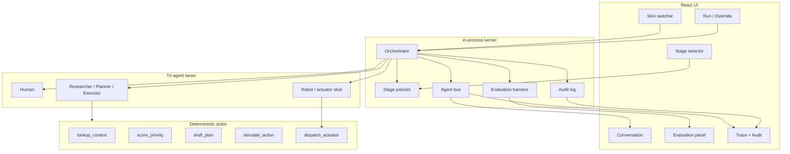

# Tri-Agent Maturity Lab

**Ship the proof, not the slide deck.**

An interactive TypeScript lab for the **AGENT Framework**, a **tri-agent workforce**, and the **4-Stage AI Maturity Model**. Dual skins (Enterprise Ops · Higher Education). Stage switches change real control flow. Zero API keys. MIT.

## Why this exists

Leaders keep asking:

- How do we move from copilots to accountable multi-agent work?
- Does that playbook transfer from the enterprise floor to campus operations?

This lab answers with **working software**. Pick a skin, pick a stage, hit **Run scenario**, and read the conversation, evaluation scores, and trace. Stage 4 stops and asks you to approve or reject before the final action — including a stub robot/actuator handoff.

Built for operators and educators who want AI × business and AI × higher-ed fluency.

## Design principle (controversial on purpose)

**Chat UIs are a Stage-1 trap.**

If your "AI strategy" is another prompt box where a human still does every irreversible step, you are practicing Assisted mode with nicer typography. Maturity is control flow: tools, coordination, policy gates, audit, and physical-digital handoff — not longer chat transcripts. This lab makes that visible. Stay in Stage 1 long enough and you will confuse conversation for capability.

Optional adjacent thinking on breaking page-shaped assumptions: [pAIgeBreaker](https://paigebreaker.com).

## Tri-agent workforce

**Tri-agent = human + AI agents + simulated robotics.**

| Lane | Role in the lab |
|------|-----------------|
| Human | Owns Stage 1 work; approves/rejects at Stage 4 |
| AI agents | Researcher · Planner · Executor (stub tools, no LLM keys) |
| Robot / actuator | Stub physical-digital handoff via `dispatch_actuator` |

Specialists still matter (research → plan → execute). The third lane is the **actuator**: digital plan → simulated physical dispatch. No hardware, no secrets — just an honest stub so handoff to the floor or campus is not hand-waved.

## AGENT Framework (concrete steps)

| Phase | What happens in the lab |
|-------|-------------------------|
| **Assess** | Context pull (`lookup_context`), priority scoring (`score_priority`) |
| **Generate** | Plan (`draft_plan`) and proposed action |
| **Evaluate** | Risk narrative + `simulate_action` |
| **Navigate** | Orchestrator routes work across roles by stage policy |
| **Track** | Stub ledger + robot/actuator handoff + follow-up note |

## 4-Stage maturity (behavior, not labels)

| Stage | Name | Real control flow |
|-------|------|-------------------|
| 1 | Assisted | Single suggestion. Human does the work. No tools. |
| 2 | Augmented | One tool-using agent proposes a plan. |
| 3 | Coordinated | Orchestrator runs researcher → planner → executor → robot. |
| 4 | Governed | Same multi-agent path + policy gate + audit + human override. |

## Evaluation harness

Every run emits **deterministic** metrics (same inputs → same scores):

- **Decision quality** — process completeness vs stage expectations
- **Cycle time** — simulated ms from stage / tools / agents / handoff
- **Cost** — relative units (agents × tools × stage weight)
- **Risk** — residual risk after path taken (including override)

No randomness. No network. Fit for demos and tests.

## Architecture

